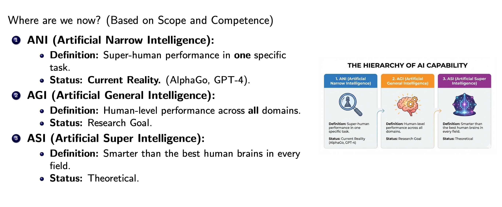

# Classification of Capability



<br/>

```pwd
[ ANI: Artificial Narrow Intelligence ]  -->  Specialized (Now)
                 │
                 ▼
[ AGI: Artificial General Intelligence ] -->  Human-Level (Upcoming)
                 │
                 ▼
[ ASI: Artificial Superintelligence ]    -->  Beyond Human (Future)
```

---

## ANI (Narrow)

Good at one task (Chess, Spam filters)

`Status`: Current Reality

[READ MORE](../../lec-02/topics/ani.md)

<br/>

## AGI (General)

Human-level capability across multiple domains

`Status`: Research Goal

[READ MORE](../../lec-02/topics/agi.md)

<br/>

## ASI (Super)

Smarter than the best human brains in every field

`Status`: Hypothetical

[READ MORE](../../lec-02/topics/asi.md)
