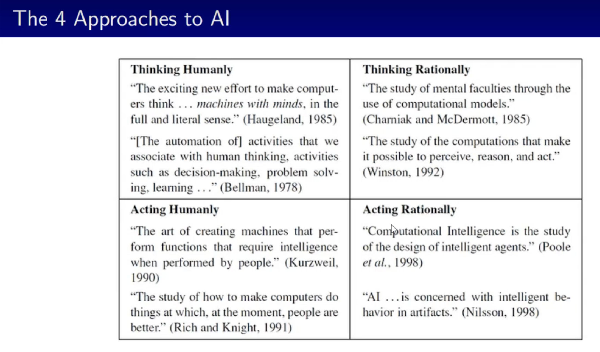
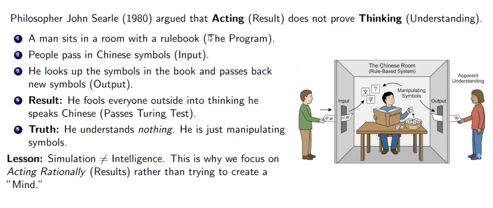
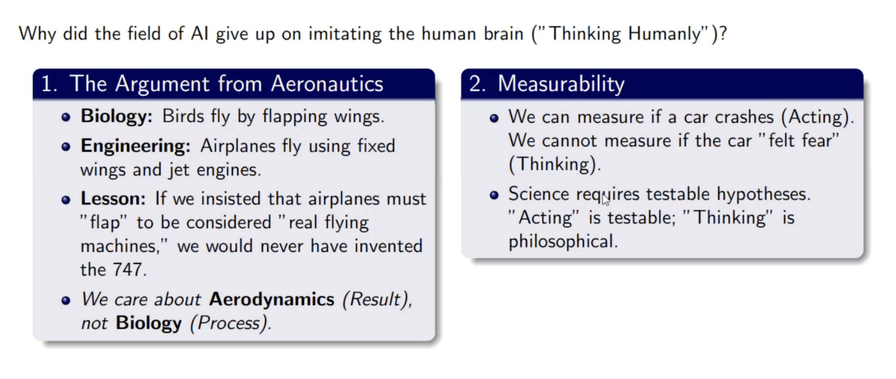
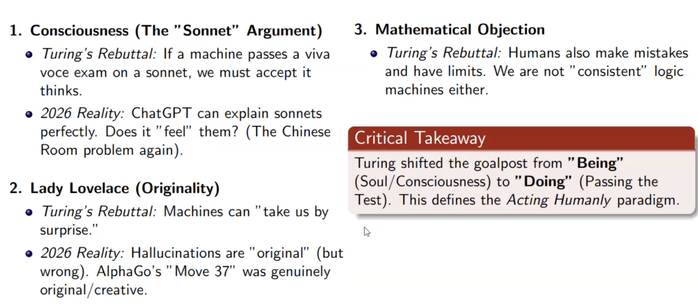
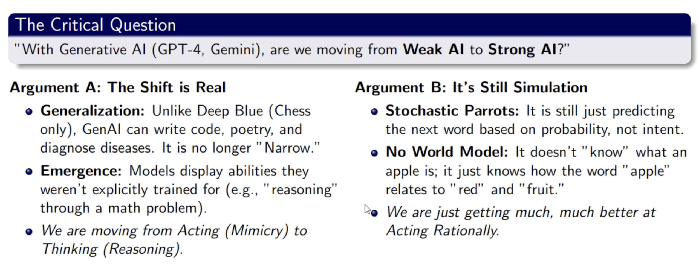

# Foundation

---

## Automatioin Vs Augmentation (වැඩි දියුණු කිරීම)

The Fundamental Question,

`"Is AI about replacing humans, or extending human capability?"`

**Automation**: Doing boring tasks faster (e.g., Data Entry, QA Testing).

**Augmentation**: Helping humans do harder tasks (e.g., AI detecting tumors doctors might miss, Copilot suggesting code structure).

 

## Intelligence

We just don't want to understand (`science`) intelligence but we also want to build (`engineering`) the intelligence as well

We can create and build the `Intelligence` by 4 Approches

This is [four-quadrant matrix - Russel Norvig](./matrix.md)

So,

`In AI we are using Acting Rationally / Act Intelligently to build the intelligence`

---

## Computing Machinery and Intelligence

For this one we can get the [Turing Test](./turing-test.md)

but with the Turing Test it count by action but,

So we are care about the `Result` not about the `Process`. So that's why we are give the priority to the `Rational Acting`

 

## Turing's Response Vs Modern Reality

 

## AI Hierarchy

 

