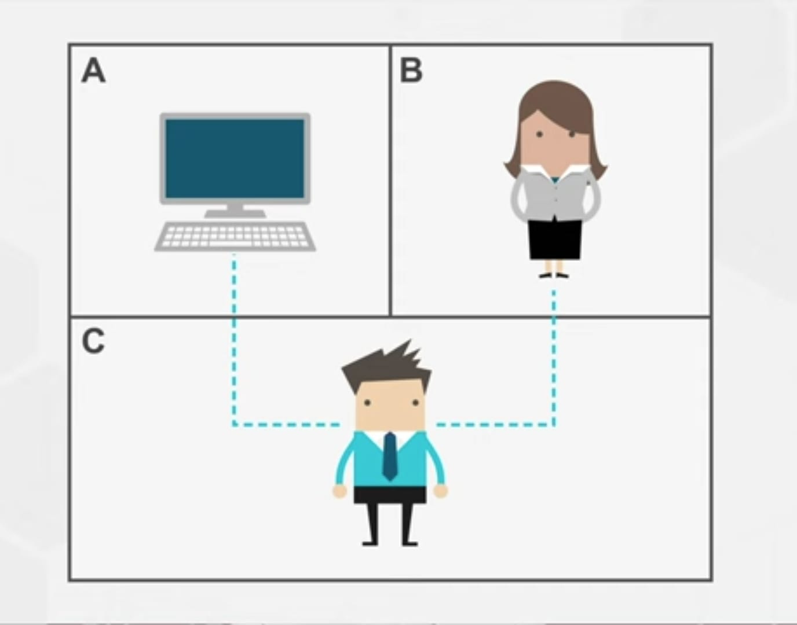

# Turing Test

In this test we are try see if machines can think or not. If machine pass this test we are calling that system as an intelligent system. We have to call them as an intelligent system.

[Download the Paper](https://courses.cs.umbc.edu/471/papers/turing.pdf)
