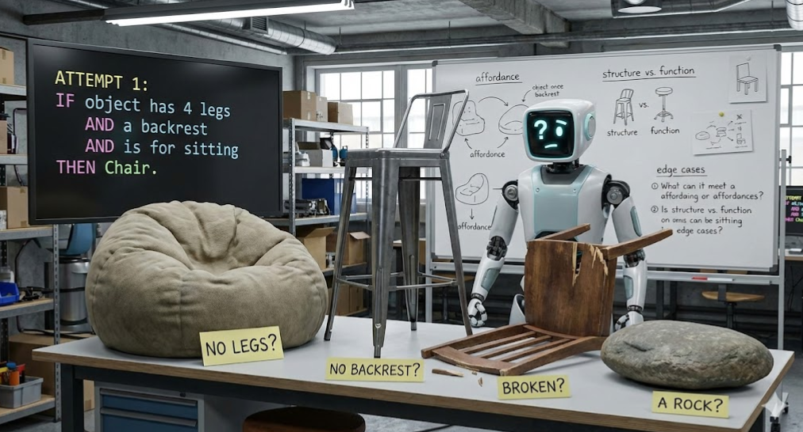
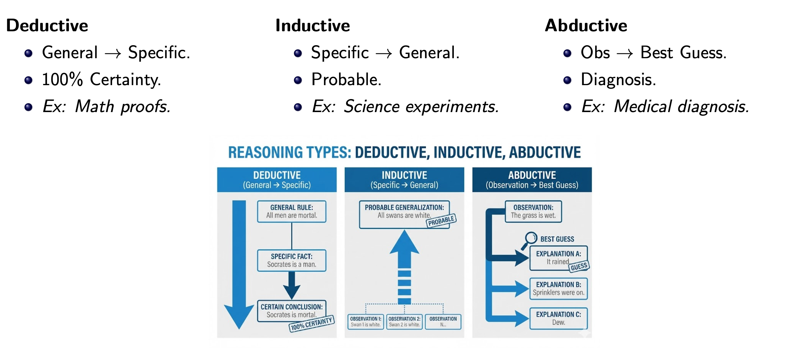
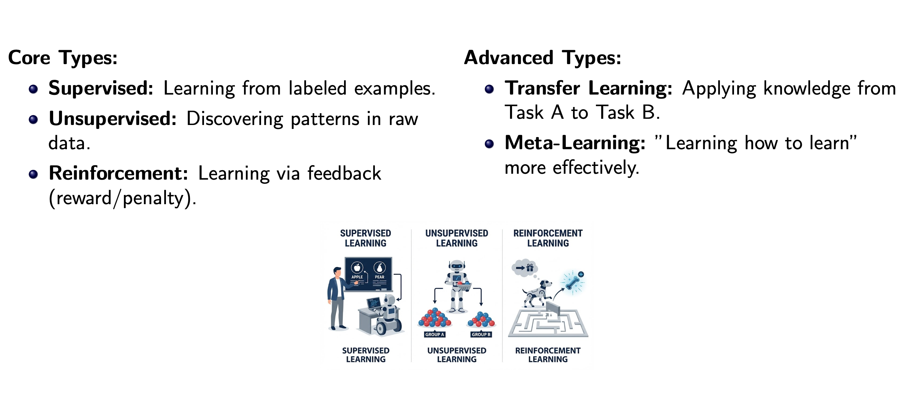
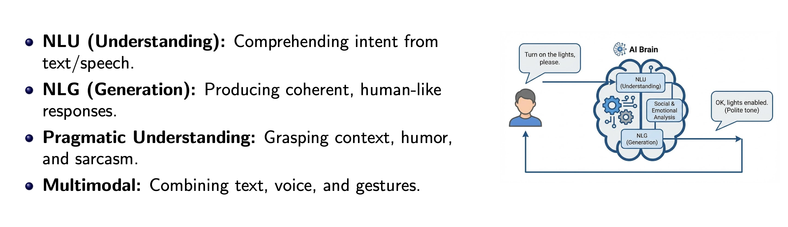

# Components of an Intelligence

We often treat AI as a magic box: `Input` → `Magic` → `Output`.

`The Engineering Reality`: Intelligence is a system of 6
interacting components. To build it, we must first break it
down.

`Perception`: Seeing/Hearing
`Reasoning`: Solving problems
`Learning`: Adapting to change
`Memory`: Storing facts and experiences
`Communication`: Language interface
`Social Intelligence`: Empathy and culture

 

## Perception (The Input Layer)

`Visual Intelligence`: Interpreting images (ComputerVision)
`Auditory Processing`: Speech recognition and audio analysis
`Multimodal Perception`: Integrating sight, sound, and text simultaneously
`Pattern Recognition`: Identifying meaningful structures in noisy data

 

## Logical Reasoning (The Basics)

 

## Advanced Reasoning (Beyond Logic)

`Causal Reasoning`: Understanding why things happen (Cause → Effect), not just correlation.

`Spatial-Temporal Reasoning`: Processing relationships in space and time (e.g., Robot navigation trajectory prediction).

`Analogical Reasoning`: Drawing parallels between different domains to solve new problems (e.g.,
”The atom is like a solar system”).

 

## Learning & Adaptation

 

## Memory & Knowledge Representation

`Semantic Memory`: General factual knowledge about the world (e.g., ”Paris is in France”)
`Episodic Memory`: Memory of specific autobiographical events (e.g., ”What I said yesterday”)
`Working Memory`: Temporary storage for active processing (RAM)
`Knowledge Graphs`: Structured networks defining relationships between entities

 

## Communication (The Interface)

 

## Social & Interpersonal Intelligence

The frontier of modern AI.

    - `Theory of Mind`: Modeling what the user knows, believes, or intends.
    - `Emotional Intelligence`: Detecting sentiment and adjusting tone accordingly.
    - `Cultural Awareness`: Understanding norms (e.g., politeness levels in different languages).
    - `Collaborative Intelligence`: Working effectively alongside humans (Cobots).

 
