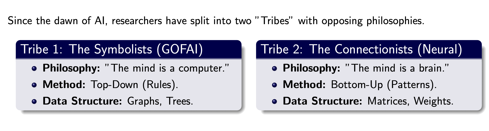
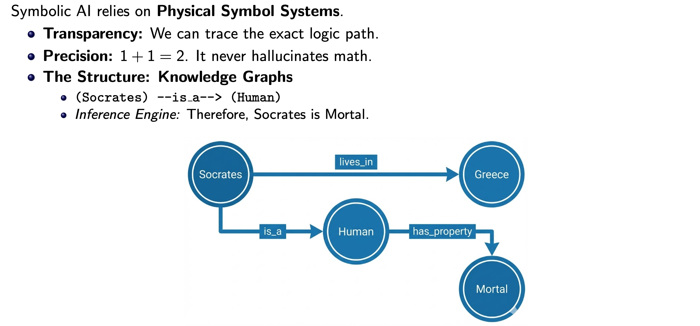
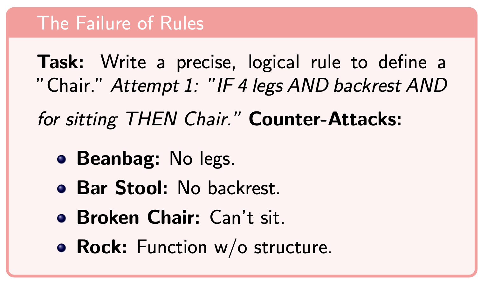
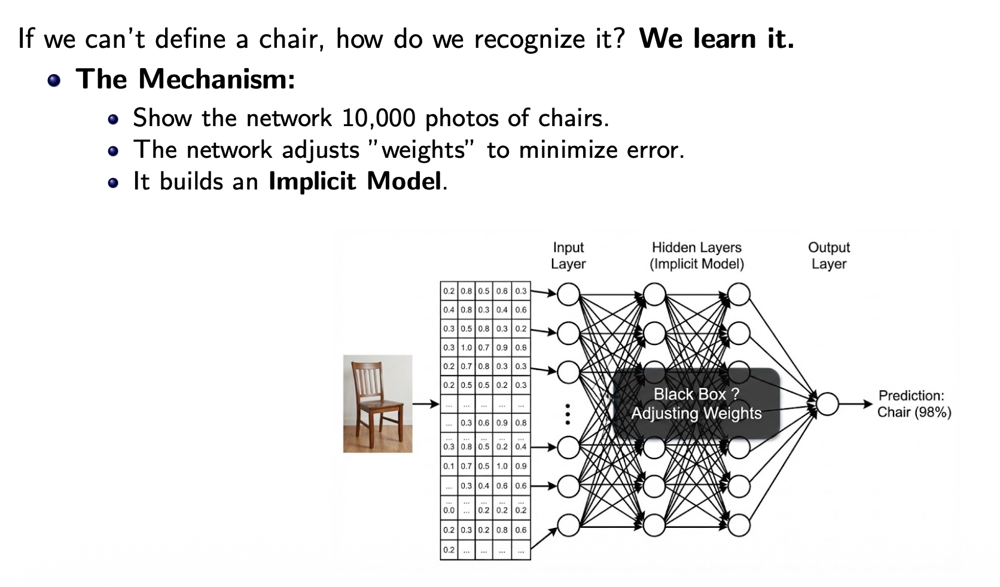
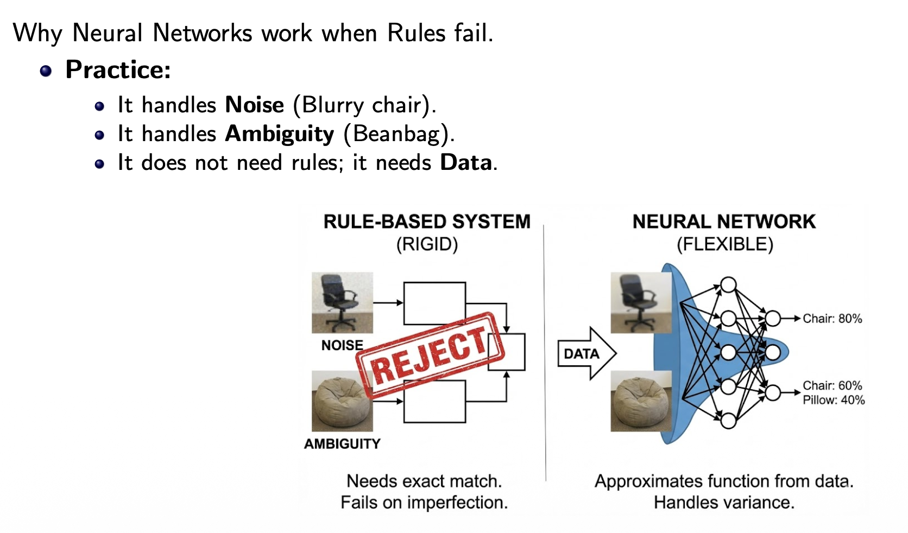
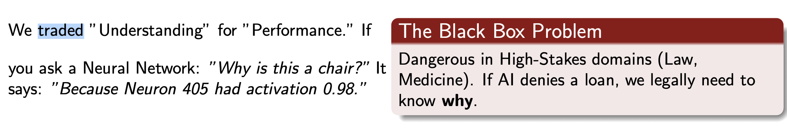
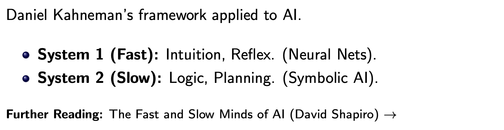
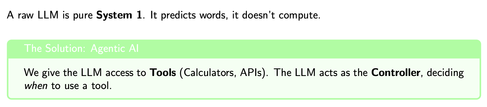
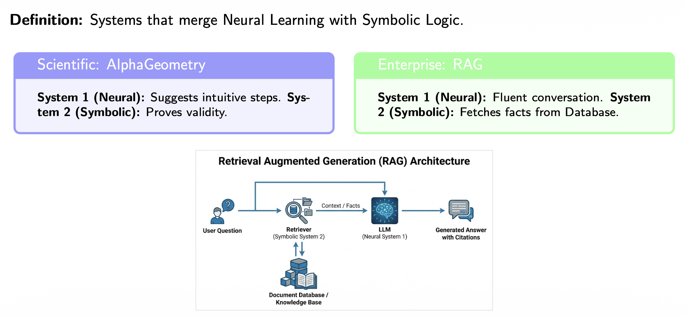
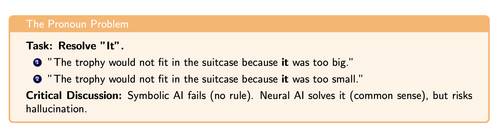

# The Grand Divide of AI



<br/>

```pwd
                 AI (1950s)
                     │
      ┌──────────────┴──────────────┐
      │                             │
   Symbolic AI             Learning-based AI
 (Rules & Logic)          (Statistics & Data)
      │                             │
 Expert Systems            Neural Networks
 Knowledge Graphs          Deep Learning
 Planning                  Transformers
 Reasoning                 ChatGPT, Gemini
```

<br/>

## Symbolic AI (The ”Glass Box”)



- `MYCIN (1970s)`: Diagnosed blood infections using 600 rules.
- `Deep Blue (1997)`: Beat Kasparov using Brute Force Search.
- `The Limitation`: No ”Common Sense.” Brittle.

```pwd
IF
    patient has fever
AND cough
THEN
    diagnose flu
```

Where is this failing,



The real world is messy. You cannot write an ”If-Then” rule for every variation. (Combinatorial
Explosion). `Polanyi’s Paradox`: ”We know more than we can tell.”

<br/>

## Connectionist AI (The ”Black Box”)



```pwd
IF cat has whiskers
AND tail
AND ears
THEN cat
```

Where is this failing,




---




---

## Neuro Symbolic Architecture

We leart that either Symbolic AI or Connectionist AI not perfect. They fail at a certain moment. So we dicide to merge these two and create a `Hrbrid System`



---



This is `Winogard Schema`
